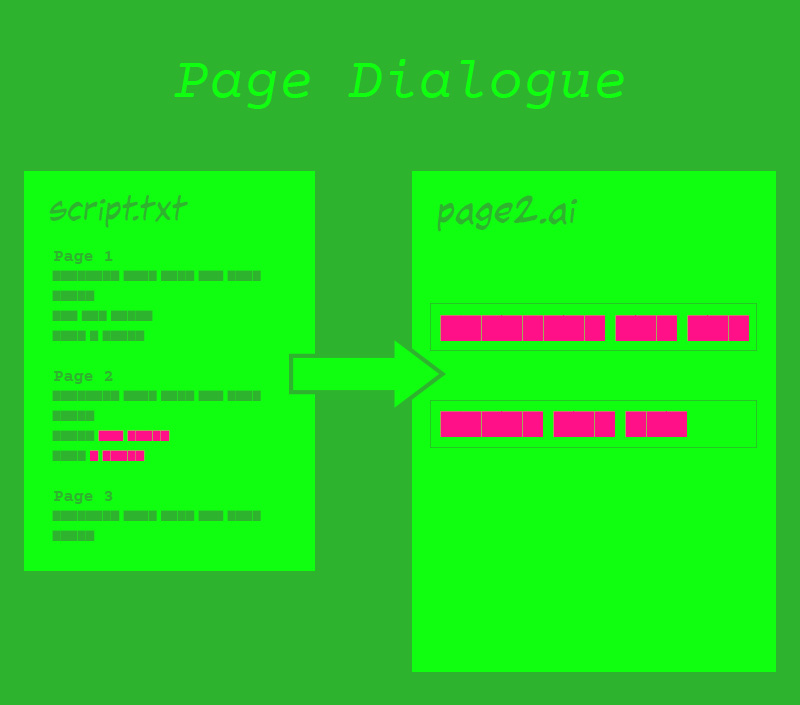
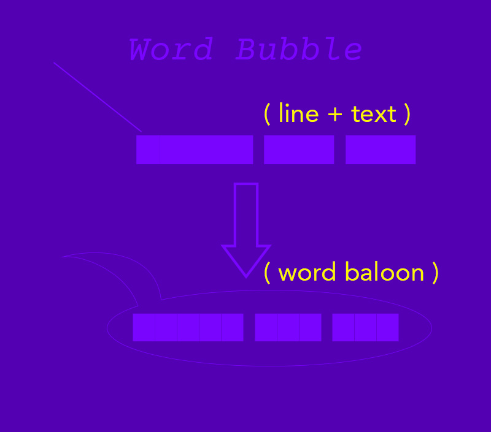

# Indie Comic Code

Hey there True Believers,

tl;dr - Here's a few ExtendScripts and Actions to expedite the comic creation process. 

Making an independent comic book is a ton of work. Writing it, drawing it, inking it, lettering it, getting it print ready, making it ready for Comixology, converting it to PDF - it's like you're an adult with a lot of work to do. 

**I don't have that kind of time.** I make my comic in my mornings, nights and weekends, so I wanted to find ways to speed it up anywhere I can. 

Thusly, here are some scripts to help speed that process up. Some may be .atn, some .jsx, and all through *sheer tomhackery*.

I am/was/will be making these to help myself. Hopefully, any independent comic creator could speed up their workflow.

## Photoshop Scripts
**Script 01** - *Place Illustrator Lettering file into Photoshop as a Smart Object*

It's easier to draw vectors in Illustrator. Plus when I want to edit the Illustrator file, I can just double click it and it opens in Illustrator.

## Illustrator Scripts

**Script 01** - *Pull dialogue for PageX*

Prompts you for the page number, you get all the dialogue as individual text boxes and removes name and description, etc. Defaults to 'Comic Geek' font by [Blambot](http://blambot.com).

**Script 02** - *Create a word balloon from a single line & a textframe*

 

This is strictly for normal word balloons. The balloon takes the size of the text frame and generates a circle, based on the perimeter. Then it takes the line and creates an arched balloon tail. Then it creates a compound shape from those two objects, thereby making it easy to adjust later.

**Script 03**  - *Create rough bubble*

TBD

## File Structure
All the scripts I've made thus far are dependent on the file sturure. I sort my directory as such:

_assets
 - Issue X Script.pdf
 - Issue X Script.txt
 - ...

00-Scan
 - 000-front-cover.tif
 - 01.tif
 - ...

01-PSD
 - 000-front-cover.psd
 - 000-front-inside.psd
 - 01.psd
 - ...

02-Lettering
 -  01.ai
 - ...

03-Coloring Flat Builds
 - ...

04-TIF-output
- ...

05-Comixology-output
 - 000-font-cover.jpg
 - ...

06-PDF
 - Comixology-version.pdf
 - Print-version.pdf
...

## AI Action Todos 
 - Update Script 01: Currently, it adds the text from the requested page. Let's create new page, place image from psd, THEN add text from matching page.

## PS Action Todos
- Format for LithoNinja
- Format for PrintNinja

## Script Todos
- <del>Pull dialogue for Page X<del>
- Convert TIFs to PDF
- Convert Comixology to PDF
- Comixology Submit Template Collection

## General Todo
- Move Todos to Github Issues
- Add Actions
- Link to other Actions online
- Convert Scripts into Plugins
- Template: Starter Bubbles for Illustrator
- ???
- Profit
