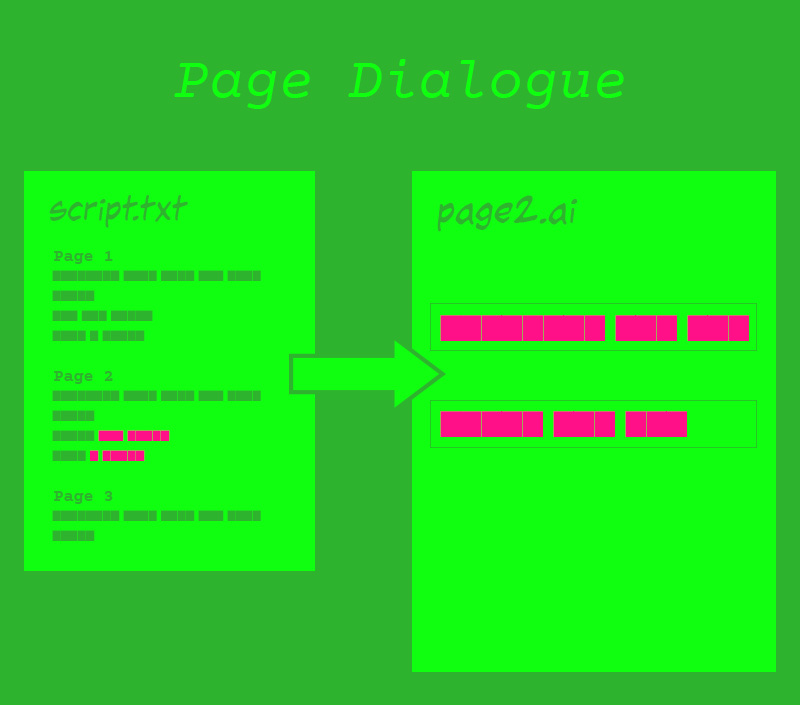
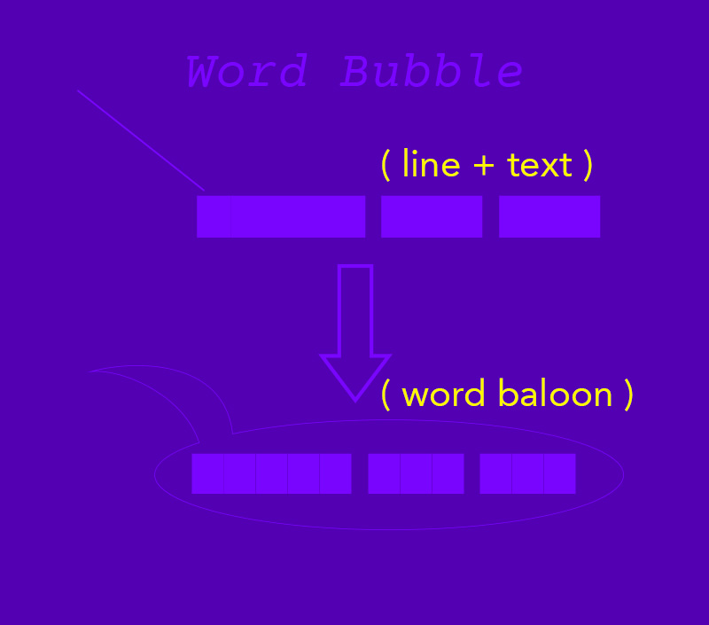

# Indie Comic Code

Hey there True Believers,

tl;dr - A few scripts and a modern UXP plugin to expedite the comic creation process.

Making an independent comic book is a ton of work. Writing it, drawing it, inking it, lettering it, getting it print ready, making it ready for Comixology, converting it to PDF - it's like you're an adult with a lot of work to do.

**I don't have that kind of time.** I make my comic in my mornings, nights and weekends, so I wanted to find ways to speed it up anywhere I can.

Thusly, here are some scripts to help speed that process up. Some may be .atn, some .jsx, and all through *sheer tomhackery*.

---

## Legacy ExtendScript Scripts

These `.jsx` files run via **File > Scripts > Other Script** in Illustrator or Photoshop. No installation required — just point the app at the file.

Tested with Illustrator 2025 (29.x) and Photoshop 2025 (26.x).

### Photoshop: `ps-code/01-placeAiInPsd.jsx`

*Place Illustrator Lettering file into Photoshop as a Smart Object*

It's easier to draw vectors in Illustrator. Plus when you want to edit the Illustrator file, you can just double-click the Smart Object and it opens directly in Illustrator.

Resolves the `.ai` path automatically from the open PSD filename and the standard project folder layout.

---

### Illustrator: `ai-code/page_dialogue.jsx`

*Pull dialogue for a specific page from your script file*



Prompts for a page number, reads `00-assets/script.txt`, and creates individual text frames for each dialogue line on that page — stripping speaker names and leaving just the text. Defaults to [ComicGeek](https://blambot.com) font by Blambot; falls back to Arial if not installed.

---

### Illustrator: `ai-code/word_bubble.jsx`

*Create a word balloon from a text frame + a line*



Select both a text frame (the dialogue) and a single line (the tail direction), then run the script. It:

1. Creates an ellipse sized to the text frame (with padding)
2. Creates a curved tail from the line
3. Merges them into a compound shape for easy editing

Works in all four tail directions (upper-left, upper-right, lower-left, lower-right). No external action sets required.

---

## Modern UXP Plugin

The `uxp-plugin/` folder contains a full **UXP panel plugin** for Illustrator that exposes all of the above functionality via a proper in-app UI panel (Window > Extensions > Indie Comic). It is self-contained and can be extracted into its own repository.

See [`uxp-plugin/README.md`](uxp-plugin/README.md) for setup instructions.

---

## Required File Structure

All scripts depend on this project folder layout:

```
<your project>/
├── 00-assets/
│   ├── Issue X Script.pdf
│   └── script.txt          ← plain-text script, used by page_dialogue
├── 00-Scan/
│   ├── 000-front-cover.tif
│   └── 01.tif
├── 01-PSD/
│   ├── 000-front-cover.psd
│   └── 01.psd
├── 02-Lettering/
│   └── 01.ai               ← matched by name to the open PSD
├── 03-Coloring Flat Builds/
├── 04-TIF-output/
├── 05-Comixology-output/
└── 06-PDF/
```

### Script file format (`script.txt`)

```
Page 1
CHARACTER: Dialogue line here.
CAPTION: Narration here.

Page 2
CHARACTER: More dialogue.
```

Page markers must be `Page N` (capital P, space, number). Dialogue lines must contain a colon; everything after the colon becomes the text frame content.

---

## Todos

- [x] Pull dialogue for Page X
- [ ] Convert TIFs to PDF
- [ ] Convert Comixology to PDF
- [ ] Comixology Submit Template Collection
- [ ] Add GitHub Issues for remaining todos
- [ ] Link to other comic Actions online
- [ ] Template: Starter Bubbles for Illustrator
